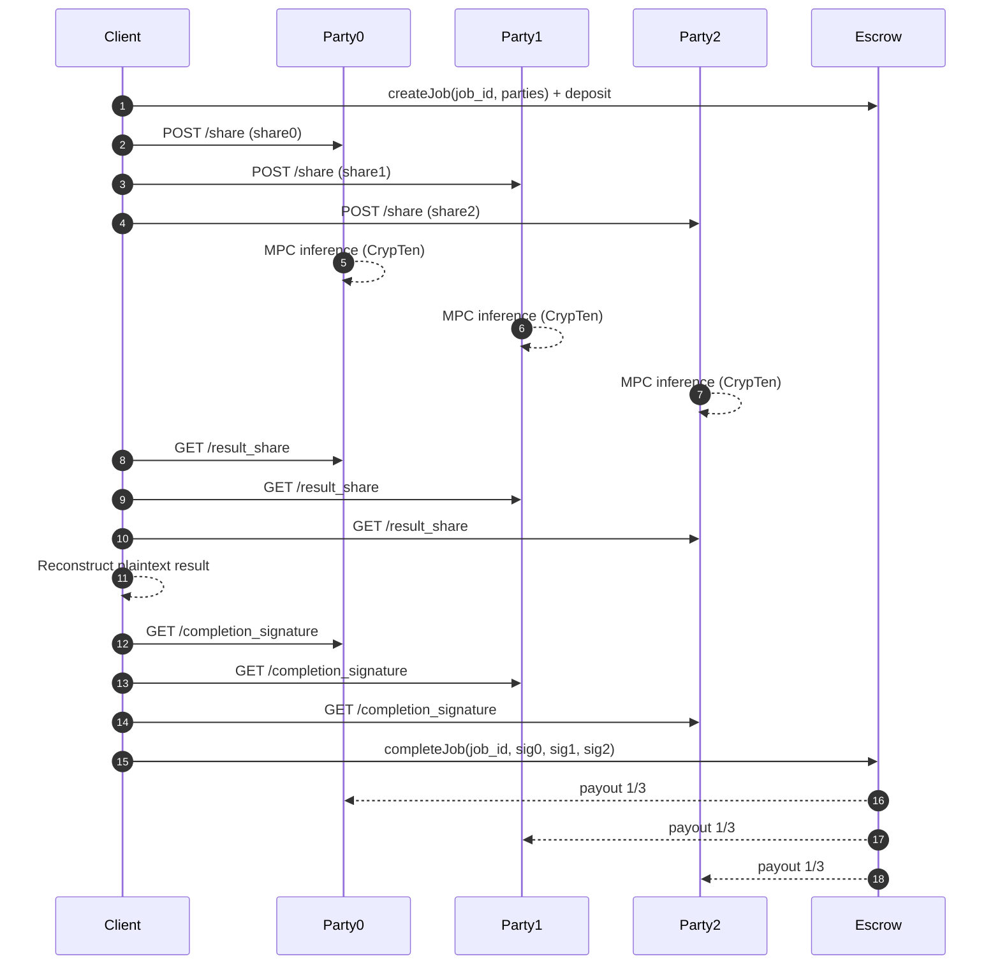
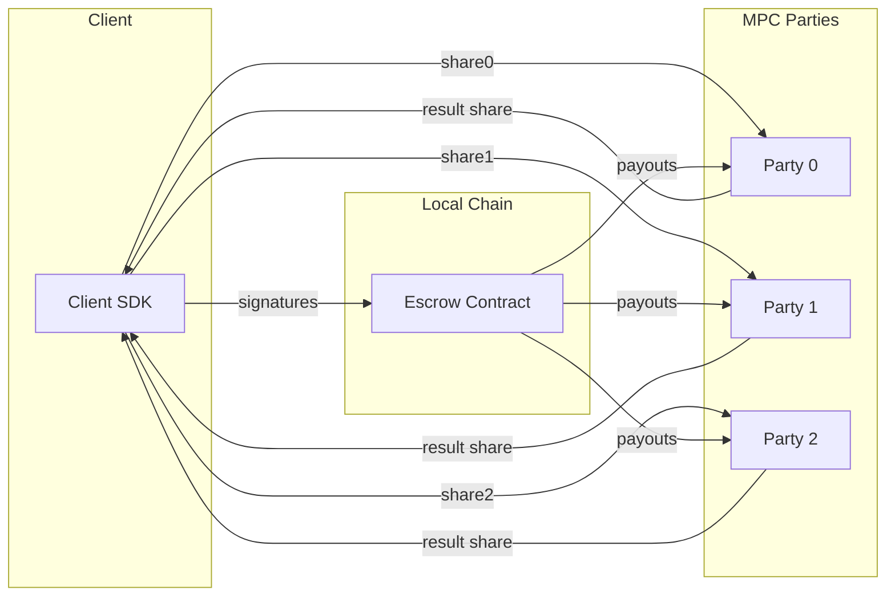

# MPC-as-a-Service PoC

## Overview

This proof-of-concept includes:
- 3 MPC parties running in Docker containers with FastAPI servers
- CrypTen-based MPC inference on a dummy PyTorch model
- Smart contract escrow on a local Ethereum network (Anvil)
- Client SDK that orchestrates the flow

## Setup

1) Ensure Docker and Docker Compose are installed.

2) Start the services:

```
docker-compose up --build
```

This launches:
- Anvil (local Ethereum network) on port 8545
- party0 on port 8000
- party1 on port 8001
- party2 on port 8002

3) Run the client (choose one):

```
# Local Python
cd client
pip install -r requirements.txt
python client.py
```

```
# Docker (recommended on Apple Silicon with precompiled artifact)
docker-compose run --rm --use-aliases client
```

Precompile the contract and point the client to the artifact (recommended on Apple Silicon):

```
docker run --rm -v "$PWD/contract:/src" ethereum/solc:0.8.20 \
  --combined-json abi,bin /src/Escrow.sol > ./contract/Escrow.compiled.json

docker-compose run --rm --use-aliases \
  -e ESCROW_ARTIFACT=/app/PoC/contract/Escrow.compiled.json client
```

CIFAR-10 will download to `./data` by default (created on first run). Override with:

```
CIFAR10_ROOT=/path/to/cifar10 CIFAR10_INDEX=0 python client.py
```

If you don't already have a local solc compiler, install one:

```
python -c "from solcx import install_solc; install_solc('0.8.20')"
```

## What happens

- Client deploys the Escrow contract on Anvil
- Client creates a job, deposits 1 ETH
- Client secret-shares a CIFAR-10 test image (1x3x32x32) into 3 additive shares
- Sends each share to one MPC party
- Parties run CrypTen MPC inference on a LeNet-style classifier ensemble loaded from `party/models`
- Each party returns a result share; the client reconstructs the plaintext result
- Client polls for completion, collects result shares and signatures from parties
- Client calls completeJob on the contract, which verifies signatures and splits the deposit equally among parties

## Notes

- Ensure `party/models` contains `.pt` checkpoints before running. This repo does not ship model weights.
- The model is untrained and random; accuracy is not the focus
- Threat model is semi-honest
- No authentication beyond job_token (PoC)
- Signatures use fixed keys for simplicity
- All components run locally
- Input is provided directly as secret shares; no party reconstructs plaintext during MPC inference.

## System overview

- **Components:** 3 MPC parties (FastAPI + CrypTen), client SDK, local Anvil escrow contract.
- **Networking:** client sends additive input shares directly to each party; parties coordinate via CrypTen (gloo + rendezvous).
- **Inference:** each party loads model weights from `party/models` and runs an ensemble for MPC inference.
- **Result reconstruction:** parties return output shares to the client; client sums and decodes to plaintext.
- **Settlement:** parties sign `hash(job_id, client_address)`; client submits signatures to `completeJob` for 1/3 payouts.

## Workflow

1) **Setup**
   - Start Anvil + 3 MPC parties:
     ```
     docker-compose up --build
     ```
   - Run the client flow:
     ```
     cd client
     python client.py
     ```
2) **Job creation**
   - Client generates `job_id`/`job_token`.
   - Client deploys `Escrow` and calls `createJob(job_id, parties)` with deposit.
3) **Secret sharing + dispatch**
   - Client creates 3 additive shares of the input tensor.
   - Each share is POSTed to `/share` on party0/party1/party2.
4) **MPC inference**
   - Parties rendezvous via CrypTen (gloo).
   - Each party runs the same model on encrypted input and produces a local result share.
5) **Result reconstruction**
   - Client fetches `/result_share` from all 3 parties.
   - Client sums shares and decodes to plaintext result.
6) **Settlement**
   - Client fetches `/completion_signature` from each party.
   - Client calls `completeJob(job_id, sig0, sig1, sig2)` to release escrow (1/3 each).

## Diagram




